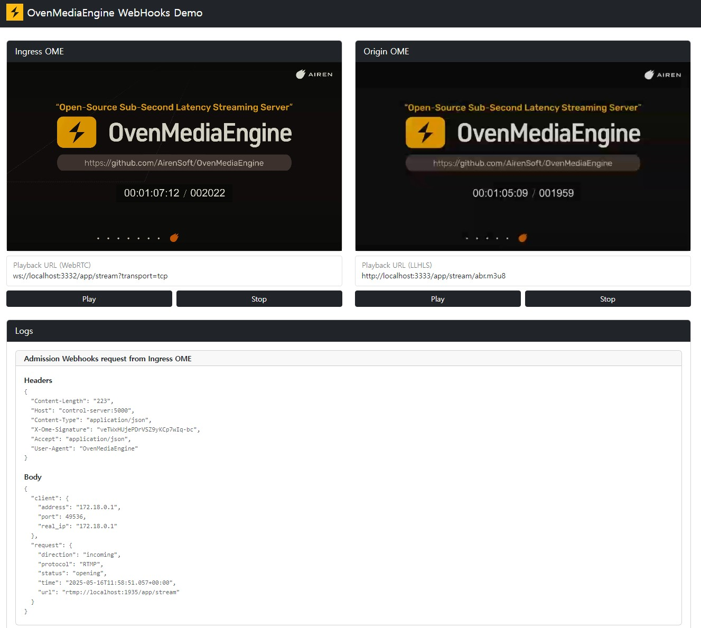
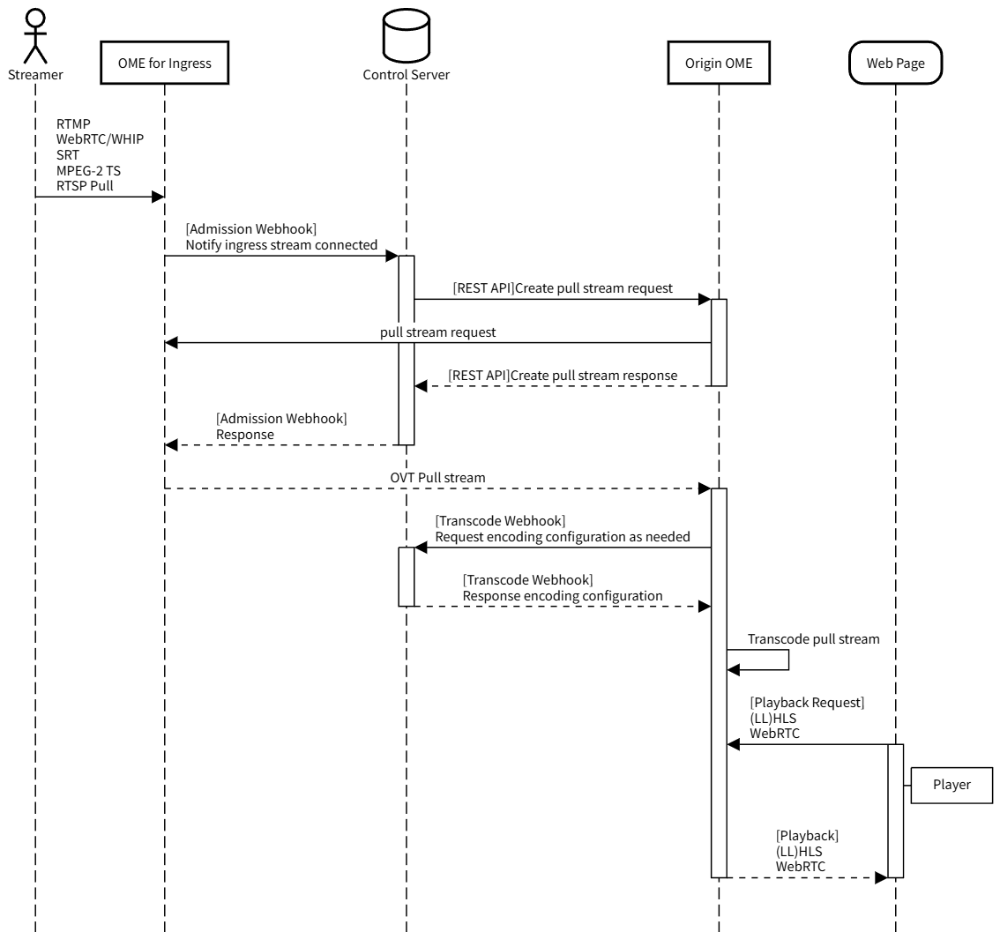

# Webhooks Demo

This project demonstrates how to use OvenMediaEngine's Admission Webhook to enable stream push/pull between two OvenMediaEngine instances, and the Transcode Webhook to dynamically configure encoding settings.



> [!NOTE]
> This is not yet version 1.
> - The architecture may change.

## QuickStart

### 1. Creating Docker containers

After pulling/cloning the project, create the containers with the following 
command:
```
docker compose up (-d)
```

This Docker Compose file creates the following three containers.

#### - `ingress-ome` container

- Receives RTMP streams on port 1935.
- The Ingress OME sends an Admission Webhook request to the Control Server. Based on the request, the Control Server selects an appropriate Origin OME and initiates the creation of a pull stream on the selected Origin OME.
- For debugging purposes, the received RTMP stream can be played via WebRTC protocol using port 3332.

#### - `origin-ome` container

- The Origin OME receives a create pull stream request from the Control Server.
It then uses the Control Server’s Transcode Webhook to retrieve an appropriate encoding profile and creates the stream accordingly.
- The created stream can be played as LL-HLS using port 3333.


#### - `control-server` container

- Processes Webhook requests from Ingress OME and Origin OME.
- The Demo Web Page can be accessed on port 5000.

### 2. Access to Demo page

Access the Demo Web Page at the following address:

```
http://localhost:5000/
```

### 3. Broadcasting RTMP stream

Use OBS or your preferred encoder to broadcast an RTMP stream to the following address:

- Server: `rtmp://localhost:1935/app`
- Stream Key: `stream`

When the RTMP stream broadcast begins, you can play both the stream received by the Ingress OME and the stream broadcast by the Origin OME from the Demo Web Page. And you can also view the full payloads of the Webhook calls and OME REST API requests.

## Configure OMEs and modify Control server source code

In the demo, you can modify the OME configuration and the Control Server source code to verify various behaviors.

### OME Configurations

The OME configurations can be modified through the Server.xml files located in the conf directories under ingress_ome and origin_ome.

> [!NOTE]
> To apply the updated configuration, you need to restart the containers using docker compose restart.

### Modify Control Server Source Code

Changes to files under the control_server directory take effect immediately. Feel free to test various scenarios.

## Architecture

