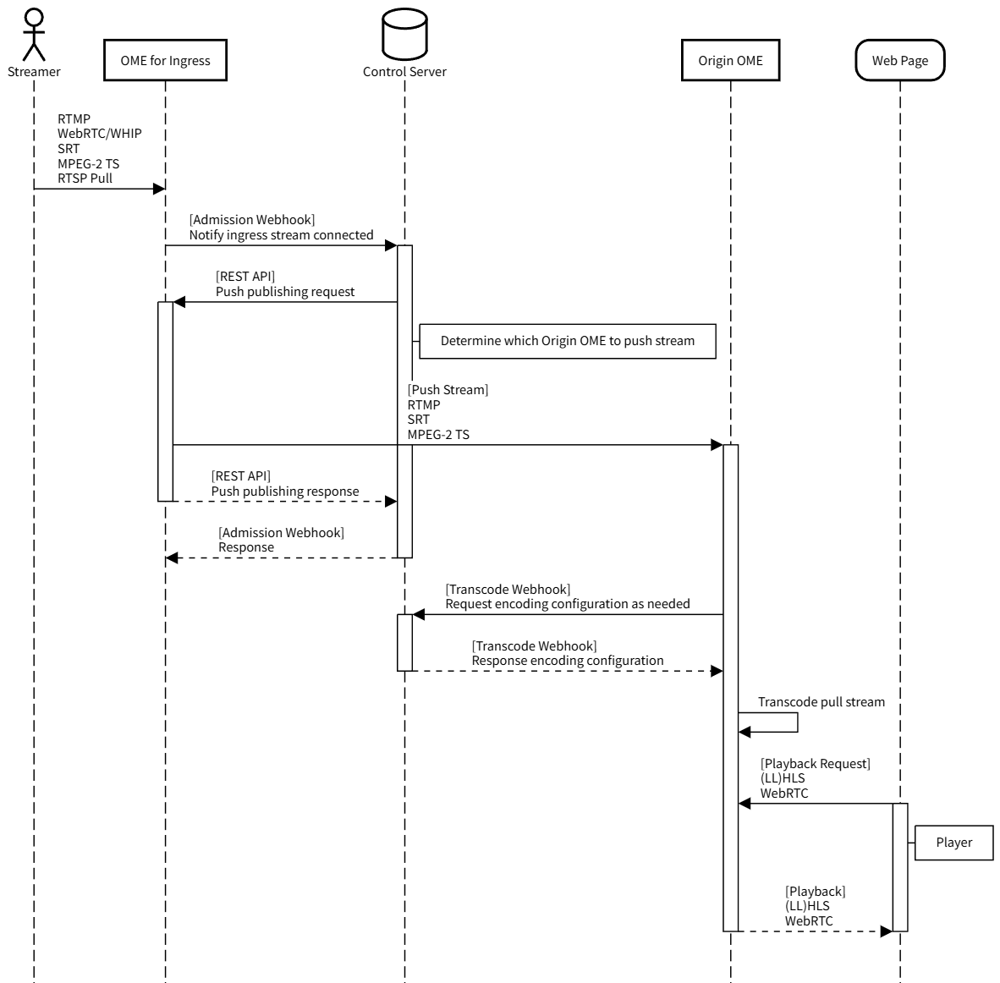

# Webhooks Demo

This project demonstrates how to use OvenMediaEngine's Admission Webhook to enable stream push/pull between two OvenMediaEngine instances, and the Transcode Webhook to dynamically configure encoding settings.

> [!NOTE]
> This is not yet version 1.
> - The structure may change.
> - Logs and various settings are not optimal.
> - The Demo Web Page is not yet developed.
> - It has not been thoroughly tested.

## QuickStart

### 1. Creating Docker containers

After pulling/cloning the project, create the containers with the following command:
```
docker-compose up (-d)
```
The docker compose configuration can be found in [compose.yml](compose.yml). The main components are as follows:

#### - `ingress-ome` container

- Receives RTMP streams on port 1935.
- Sends Admission Webhook requests to the Control Server to PUSH the received RTMP stream to the Origin OME.
- For debugging purposes, the received RTMP stream can be played via WebRTC protocol using port 3332.
- OME configuration can be found in [Server.xml](ingress_ome/conf/Server.xml).

#### - `origin-ome` container

- Receives streams PUSHED from the Ingress OME.
- Sends Transcode Webhook requests to the Control Server to dynamically configure encoding.
- The PUSHED stream can be played as LL-HLS using port 3333.
- OME configuration can be found in [Server.xml](origin_ome/conf/Server.xml).


#### - `control-server` container

- Processes Webhook requests from Ingress OME and Origin OME.
- The Demo Web Page can be accessed on port 5000.

### 2. Broadcasting RTMP stream

Use OBS or your preferred encoder to broadcast an RTMP stream to the following address:

- Server: `rtmp://localhost:1935/app`
- Stream Key: `stream`

### 3. Verifying stream playback

Access the Demo Web Page at the following address:

```
http://localhost:5000/
```
- When the RTMP stream broadcast begins, you can play both the stream received by the Ingress OME and the stream broadcast by the Origin OME from the Demo Web Page.


## Modifying and applying Control Server source code

For testing purposes, you can modify the Control Server source code. The Control Server source code can be found in [ControlServer.py](control_server/ControlServer.py).

Currently, you can update the `control-server` container using the following command:

```
docker-compose build control-server && docker-compose up (-d)
```

## Architecture

